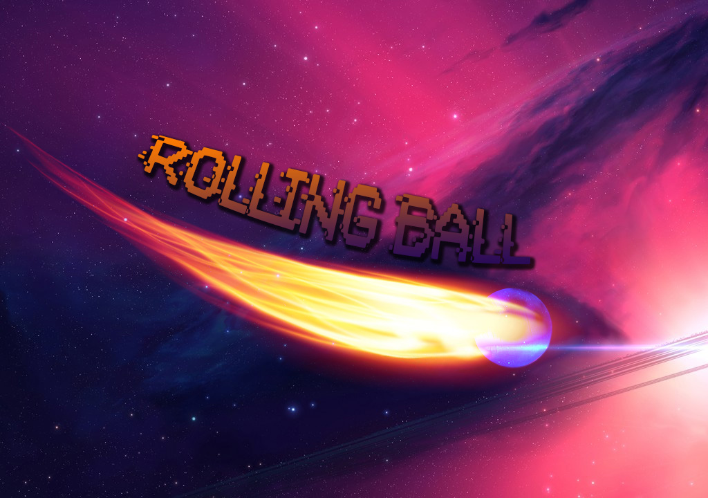

Here what you need to know before starting the game :

You have time to end it, so make it quickly but the goal is to have the higher score possible.
Yellow pill increase you score and time by one.
Green pill change your size.
Blue pill add you some time.
You earn time by changing maze aswell.
You can change 2D to 3D Ball by tapping the screen and change labyrinthe sprite with a long press.
The game is obviously runnable only on Android smartphone.

Credit to Salih Nascimento for the splashscreen.

